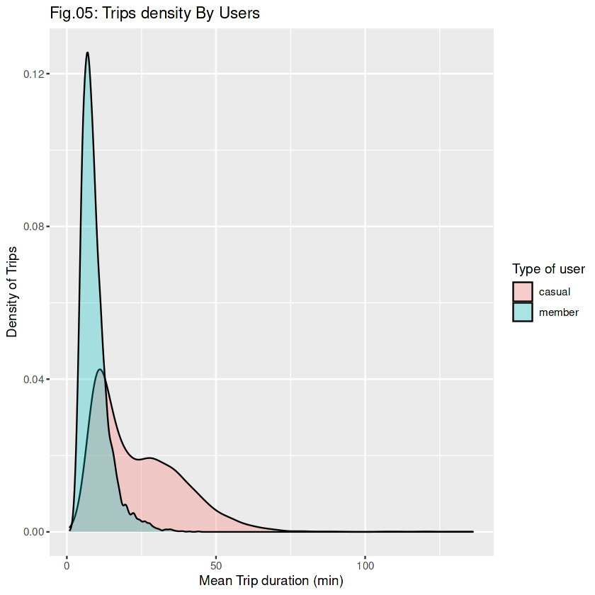
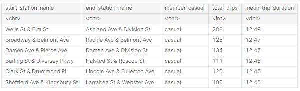

# Objetivo del proyecto

El objetivo es conocer cómo se comportan los usuarios que son suscriptores y cómo lo hacen los que no lo son, así como intentar conocer por qué un usuario se haría miembro y cómo podemos dirigir el marketing para lograr una mayor retención.

# Origen de los datos

Todos los datos necesarios están subidos en un repositorio de Kaggle (https://www.kaggle.com/datasets/yazeedrana/cyclistic-trips-202108-to-202207)

# Programas y paquetes

Todo el análisis en R, paquetes principales: tidyverse, dplyr, ggplot2, lubridate.

# Procesos realizados

1. Unión de bases de datos, 
2. Limpieza de datos (nulls y cambios de formato)
3. Creación de gráficos con agrupación

# Resultado del análisis

## Distribución de viajes por semana y tipo de usuario:
 

## Distribución de viajes por mes y tipo de usuario:
 

## Distribución de viajes por media de minutos de viaje y tipo de usuario:

## Principales rutas para realizar el marketing: 

# Lecciones aprendidas y recomendaciones

1. Visualización de datos de múltiples maneras
2. Abstracción y búsqueda de respuestas a los propietarios
3. Redacción y documentación de todo el proceso

# Limitaciones y qué puede ser mejorado

Me parece un dataset bastante completo, al final descubrí que era de Chicago y se podría realizar una visualización en base a un mapa que mostrara las principales rutas y estaciones más usadas por cada tipo y poder ver claramente mihipótesis y poder potenciarl el análisis. También con información de edades se podría saber a quién , cómo y dónde poner anuncios para conseguir más suscriptores.
Obviamente también tengo limitaciones por ser mi primer proyecto y seguro que lo haré mucho mejor en el futuro si lo intento de nuevo.
