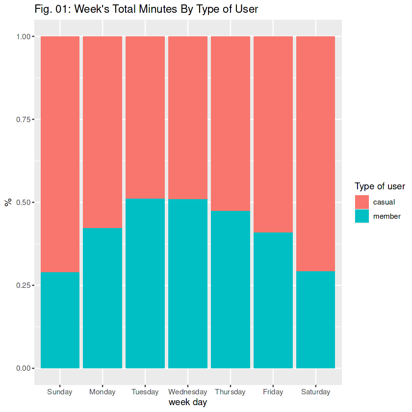

# Objetivo del proyecto

El objetivo es conocer cómo se comportan los usuarios que son suscriptores y cómo lo hacen los que no lo son, así como intentar conocer por qué un usuario se haría miembro y cómo podemos dirigir el marketing para lograr una mayor retención.

# Origen de los datos

Todos los datos necesarios están subidos en un repositorio de Kaggle (https://www.kaggle.com/datasets/yazeedrana/cyclistic-trips-202108-to-202207)

# Programas y paquetes

Todo el análisis en R, paquetes principales: tidyverse, dplyr, ggplot2, lubridate.

# Procesos realizados

1. Unión de bases de datos, 
2. Limpieza de datos (nulls y cambios de formato)
3. Creación de gráficos con agrupación

# Resultado del análisis

## Distribución de viajes por semana:
 

## Distribución de viajes por mes:
 

# Lecciones aprendidas y recomendaciones

# Limitaciones y qué puede ser mejorado
